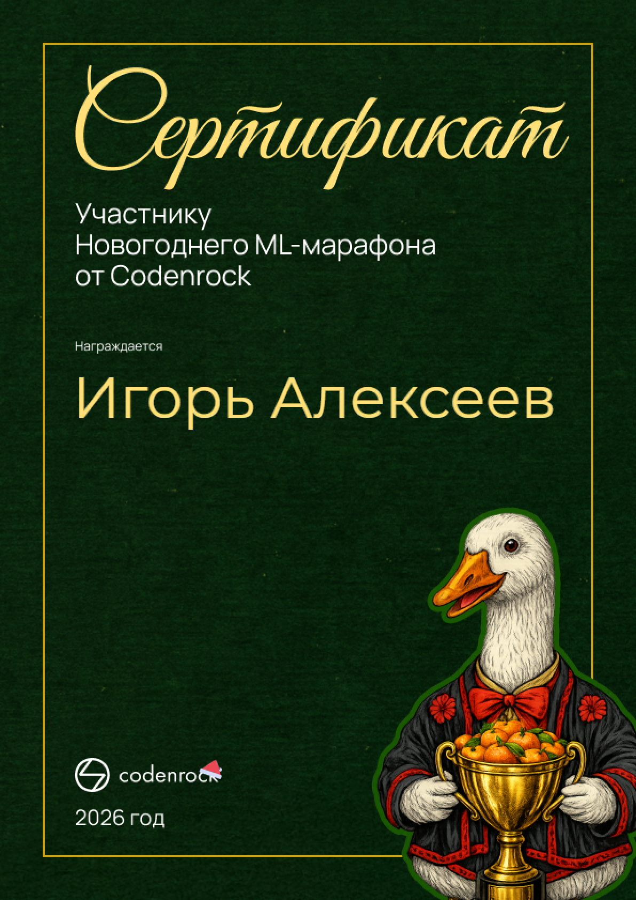

# Новогодний ML-марафон Codenrock 2026

Индивидуальное онлайн-соревнование от Codenrock, 4–18 января 2026. Формат — четыре задачи нарастающей сложности, каждая открывается только после предыдущей; решение отправляешь CSV-файлом на автоскоринг. Из 507 участников до конца дошли 60.

## Задачи

**1. "Выживет ли ёлка до 18 января?"** — бинарная классификация по ~18 000 ёлкам (вид, возраст, условия хранения). Обычный EDA + фичи по условиям хранения, CatBoost/XGBoost с подбором гиперпараметров.

**2. "Холодильник после праздников"** — классификация того, что осталось в холодильнике, по ~20 000 записям истории содержимого. Категориальные признаки взял как есть — CatBoost с ними работает нативно.

**3. "Колбаса или конфетти?"** — многоклассовая классификация типа загрязнения на 700 коврах после застолья. Здесь уже дисбаланс классов — пришлось делать class weights и стратифицированную кросс-валидацию.

**4. "Переполох в домовом чате"** — самая нестандартная задача: разложить 30 000 сообщений домового чата по темам. TF-IDF + кластеризация/классификация с предразметкой.

## Вывод

Каждую задачу решал за один вечер: быстрый baseline, потом итеративно улучшал. К четвёртой задаче (NLP) стало ясно, что скорость итерации важнее, чем попытка сразу собрать идеальную модель.

**Стек:** Python, CatBoost, XGBoost, scikit-learn, pandas, numpy

## Сертификат

PDF-версия: [certificate.pdf](certificate.pdf)
