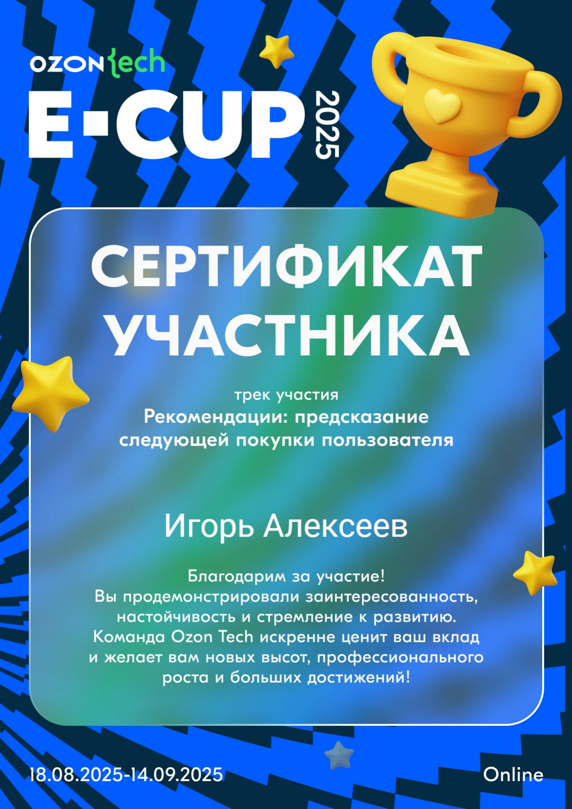

# Ozon E-CUP 2025 — рекомендации следующей покупки (Apparel)

Решение для трека **"Рекомендации: предсказание следующей покупки пользователя"** на [Ozon E-CUP 2025](https://codenrock.com/blog/kejs-ozon-e-cup-2025-kak-2900-inzhenerov-sozdali-ml-resheniya-dlya-millionov-polzovatelej/) — ML-соревновании от Ozon Tech на платформе Codenrock (2984 участника, 1221 команда). Соревновались на реальных данных категории Apparel (одежда, обувь, аксессуары).

**Задача:** по истории взаимодействий пользователя за 6 месяцев собрать топ-100 товаров, которые он купит. Метрика — NDCG@100.

## Данные

Организаторы дали три куска: трекер событий (просмотры/корзина/покупки, ~1.6 млрд записей, 200 parquet-файлов), историю заказов (~19 млн) и каталог товаров с CLIP-эмбеддингами (~6.4 млн товаров). В сумме — около 38 ГБ parquet.

## Как решали

Начал с самого простого — взвешенной популярности: покупка × 3, корзина × 2, просмотр × 1, уже купленное из выдачи убрал. Это сразу дало NDCG ≈ 0.077 — и стало точкой отсчёта, с которой было видно, насколько реально помогают более сложные модели.

Дальше — ALS (`implicit`): собрал все сигналы в одну матрицу user × item, обучил 100 факторов, 15 итераций. ALS поднял метрику до ≈ 0.084 — уже улавливает скрытые связи между пользователями и товарами, а не просто "что популярно".

Финально комбинировал ALS-эмбеддинги со взвешенными взаимодействиями и отдельно обработал холодных пользователей (глобальный топ вместо персональных рекомендаций). Плюс ускорил чтение parquet — выборочные колонки и фильтрация на лету, иначе на 38 ГБ можно было не дождаться.

**Итог: NDCG@100 = 0.34**

Пробовал и SASRec (transformer для sequential recsys) — на этих данных проиграл бустингу/ALS: слишком сильный pop-bias, модель тянется к популярным товарам вместо реального паттерна пользователя.

## Что вынес для себя

- Простой baseline почти всегда стоит строить первым — иногда он неожиданно близко подбирается к сложным моделям, и в любом случае даёт понятную точку отсчёта.
- Сила сигнала так и работает по иерархии: покупка > корзина > просмотр. `action_widget` (поиск / карточка товара / персональная лента) добавляет полезный контекст.
- Метрика в этой задаче не равна бизнес-цели: NDCG@100 награждает за попадание в уже просмотренные товары, а не за настоящее открытие нового. Для продакшена нужен отдельный генератор кандидатов вне истории пользователя.

## Стек

Python, pandas/numpy, `implicit` (ALS), scipy.sparse, scikit-learn, pyarrow, matplotlib/seaborn, tqdm

## Сертификат

PDF-версия: [certificate.pdf](certificate.pdf)

## Ссылки

- [Ноутбук в Colab](https://colab.research.google.com/drive/1yZ5ADUbnJpBrKeFPeBn696ctxbFYHsuL?usp=sharing)
- [Разбор соревнования от организаторов](https://codenrock.com/blog/kejs-ozon-e-cup-2025-kak-2900-inzhenerov-sozdali-ml-resheniya-dlya-millionov-polzovatelej/)
- [Советы от экспертов Ozon Tech по треку рекомендаций](https://codenrock.com/blog/kak-pobedit-na-e-cup-2025-sovety-ot-ekspertov-ozon-tech/)
