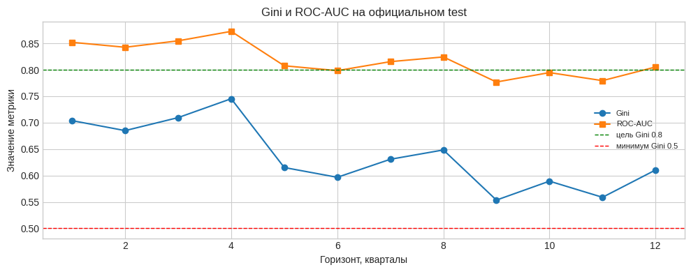
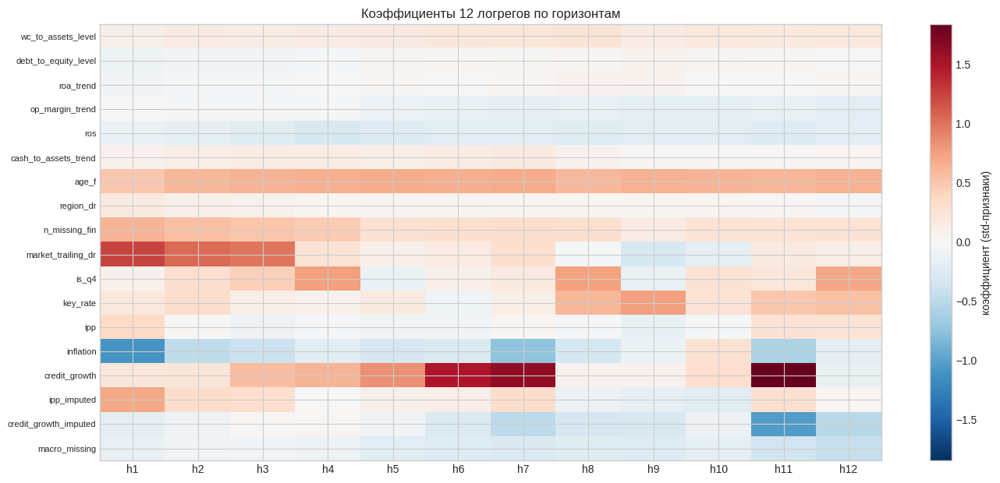
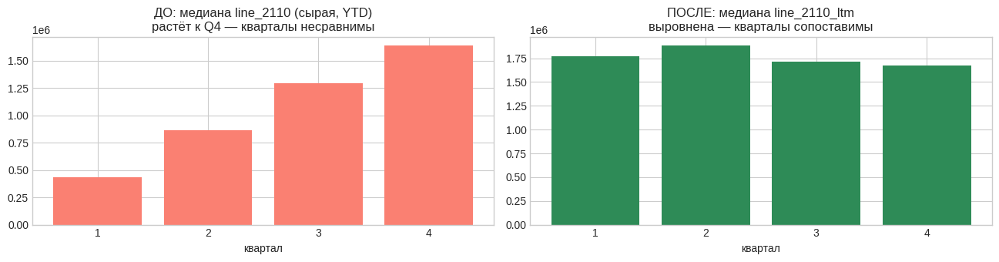
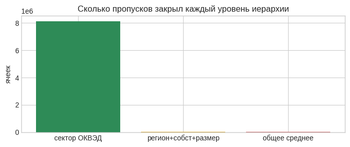
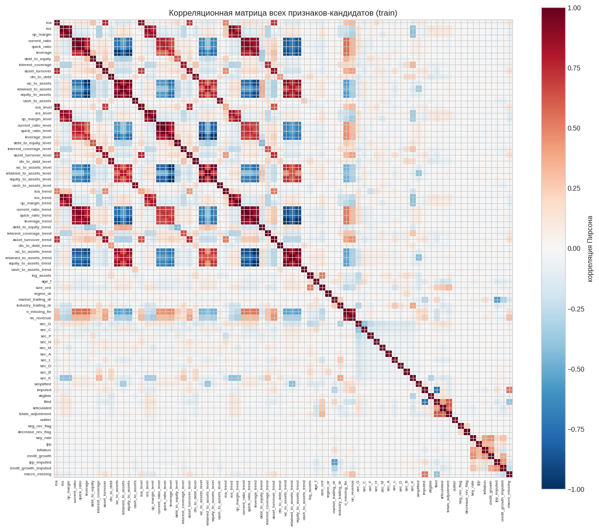
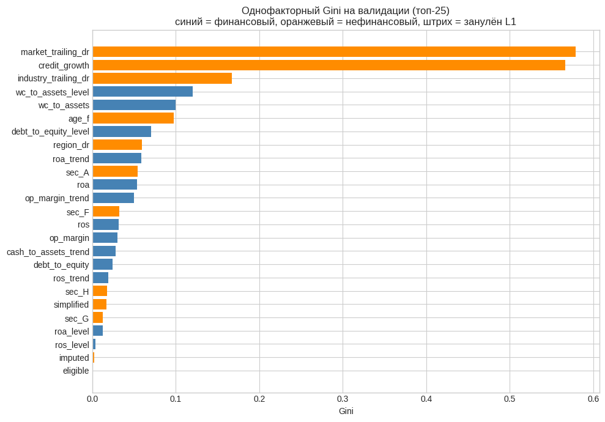
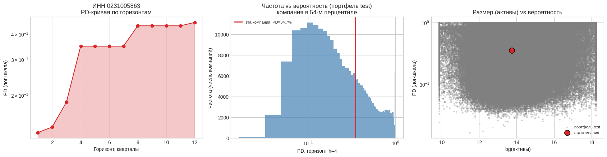

# 🏦 Кривая вероятности дефолта — кейс Сбербанка (GSOM Summer School)

Кейс от **Сбербанка** в рамках летней школы по бизнес-аналитике СПбГУ (GSOM). Команда — 3 человека, я отвечал за архитектуру модели и добавление макропараметров.

**Задача:** по квартальной финансовой отчётности компании предсказать полную кривую вероятности дефолта на 12 кварталов вперёд (до 3 лет) — неубывающую и интерпретируемую, чтобы банк мог объяснить регулятору, откуда взялись цифры резервов.

> 🔍 *«Один бинарный признак `is_q4` — квартал отчёта = Q4 — поднял Gini на внутренней валидации с 0.10 до 0.48»* — самая неожиданная находка проекта.

## 📊 Результат на официальном test

| Горизонт | 1 год | 2 года | 3 года |
|---|---|---|---|
| ROC-AUC | 0.873 | 0.824 | 0.805 |
| **Gini** | **0.745** | **0.648** | **0.610** |

Финальные модели обучены на компактном наборе признаков **плюс `is_q4` и полный блок макрофакторов** (ключевая ставка, инфляция, кредитование бизнеса, ИПП, с флагами импутации) — это видно прямо на карте коэффициентов ниже: `credit_growth` и `market_trailing_dr` дают одни из самых сильных и стабильных эффектов среди всех 76 признаков-кандидатов.

## 🧩 Данные

Официальный датасет организатора с Hugging Face (`Danisimmilian/GSOM_summer_school_Sber`) — панель российских компаний с квартальной финансовой отчётностью, ~1.4 млн строк train+test. Плюс макроэкономические ряды (ключевая ставка, инфляция, кредитование бизнеса, ИПП) с квартальной гранулярностью и лагом публикации, уже встроенным в источник.

## 🛠️ Ключевые решения

**Таргет — не то, что лежит в колонке `default`.** В датасете эта колонка почти пустая (0.13% строк), потому что настоящее событие дефолта по методике организатора — это `dissolution_date` (ликвидация компании). Формулы воспроизведены 1:1 и сверены с присланным кодом организатора побитово — совпадает на всех проверенных горизонтах.

**LTM + Level/Trend вместо сырых показателей.** Отчётность идёт нарастающим итогом внутри года, поэтому кварталы сами по себе несравнимы:

На каждый коэффициент дополнительно считается Level (среднее за 4 периода — «нормальное» состояние компании) и Trend (отклонение от него — куда движется).

**Иерархическая импутация, только по train.** Пропуск закрывается средним по сектору ОКВЭД (2 цифры) → регион+форма собственности+размер → общее среднее по train. Почти все пропуски закрывает уже первый уровень:

Отдельно зафиксирован сам факт пропуска (`n_missing_fin`, `no_revenue`) — компания перед ликвидацией обычно перестаёт нормально сдавать отчётность, и это само по себе сильный сигнал, который импутация иначе бы стёрла.

**Мультиколлинеарность — ожидаемая и не проблема.** Коэффициент и его `_level` коррелируют почти всегда — с этим разбирается L1 на следующем шаге, а не ручной дроп пар:

**Отбор признаков: L1 + однофакторный Gini.** Топ по одиночной предсказательной силе — как раз макро (`market_trailing_dr`, `credit_growth`):

**12 независимых логистических регрессий (L1), а не одна модель на все горизонты.** У каждого горизонта свои коэффициенты — на коротких важнее ликвидность, на длинных — рентабельность, форма PD-кривой получается из данных сама, без искусственных hazard-весов. Логрег выбран вместо бустинга сознательно: банку нужно объяснять регулятору коэффициенты, а не таблицу SHAP.

**Андерсэмплинг для скорости, без потери корректности.** Обучение с `class_weight='balanced'` на полных данных упиралось в 10+ минут на одну модель. Взял все позитивы + 20 случайных негативов на позитив, пересчитав силу L1-регуляризации (`C_eff = C_base × n_полное/n_сэмпл`) так, чтобы задача была математически эквивалентна обучению на полных данных — 12 моделей теперь обучаются за минуты.

**Макрофакторы — с измеренным обоснованием, а не просто «для галочки».** Перед тем как включать их в модель, проверил корреляцию каждого макрофактора с фактической квартальной долей дефолтов: инфляция ↔ дефолт на горизонте 3 года (r = 0.58, p = 0.0004), кредитование бизнеса ↔ дефолт на горизонте ~1.25 года (r = 0.57, p = 0.0002).

**Калибровка не поднимает Gini — и это проверено, а не предположено.** ROC-AUC/Gini — ранговые метрики: они не меняются от монотонного пересчёта вероятностей. Прогнал изотоническую калибровку на независимой половине test — AUC до и после совпадает с точностью до 4 знака. Калибровка нужна банку для правильного абсолютного уровня PD (резервы, прайсинг), а не как способ улучшить ранжирование.

**Пример PD-кривой для конкретной компании** (из портфеля test):

## ⚠️ Открытые вопросы (к защите)

- У `cash_to_assets_trend` и `age_f` знак коэффициента расходится с экономическим ожиданием — отмечено в коде как «посмотреть отдельно перед защитой», возможен артефакт расчёта, а не повод сразу исключать признак.
- Эффект `is_q4` настолько сильный, что стоит явно обсуждать: реальный сигнал или артефакт того, что реестр фиксирует ликвидации пачками к концу года.
- Официальная доля дефолтов на горизонте 12 мес. (0.13%) в 40 раз ниже ориентира организатора (~5%) — сверка кода подтверждает, что это свойство официального датасета, а не ошибка.

## 📦 Стек

Python, Polars (панельные данные: window-функции, join по времени), pandas, scikit-learn (LogisticRegression + L1), statsmodels (p-values коэффициентов), Hugging Face `datasets`, matplotlib/seaborn, psutil (контроль памяти в Colab).

## 📁 Файлы

- [`solution.ipynb`](solution.ipynb) — полный пайплайн: загрузка → таргеты → признаки → импутация → отбор признаков → 12 моделей → калибровка → self-check по ТЗ
- [`images/`](images) — все графики из ноутбука
