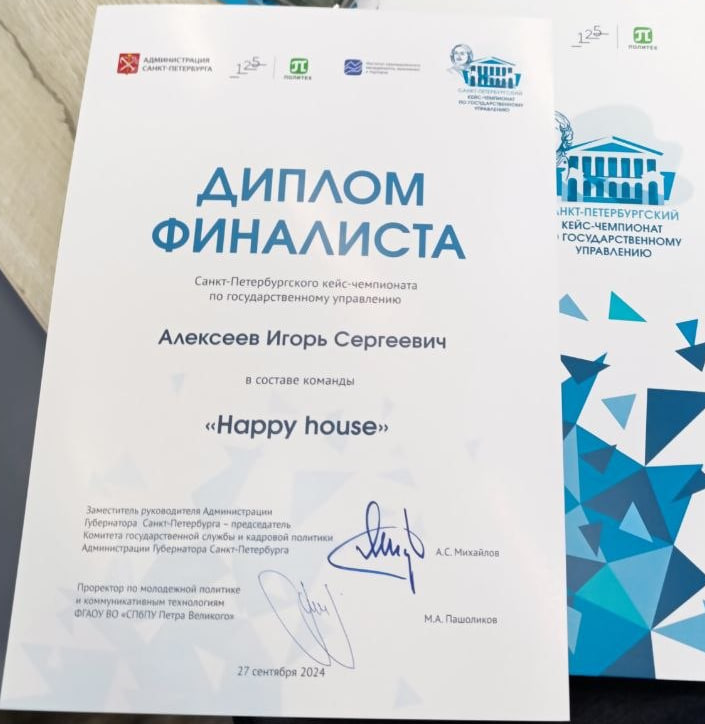

# Санкт-Петербургский кейс-чемпионат по государственному управлению, 2024

Студенческий кейс-чемпионат Администрации Санкт-Петербурга (проект «Карьерная среда»). Команды решают реальные городские задачи и защищают решения перед представителями администрации.

**Результат:** финалист, диплом от 27 сентября 2024 года. Команда «Happy house».

## Как проходил

1. Отборочный этап: видеовизитка команды и защита кейса.
2. Финал: выступление с решением кейса перед Администрацией Санкт-Петербурга.

